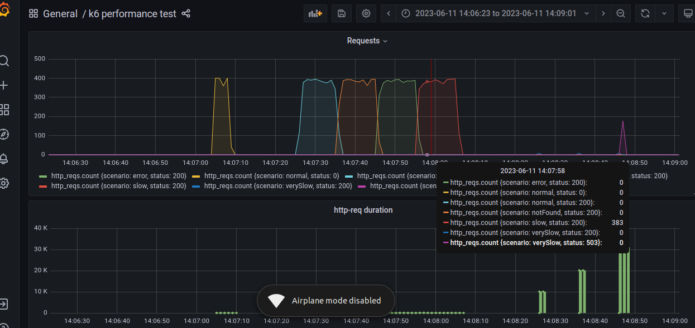

# My app

### Description
It has been implemented a Redis cache for product details retrieval and similarity search, aiming to avoid overloading the APIs. Additionally, different threads (multithreading) have been implemented to make multiple calls to the REST API.

### Here's an example in Grafana:

- The first test includes Redis and multithreading implementation.
- The second test doesn't include any of the aforementioned functionalities.

